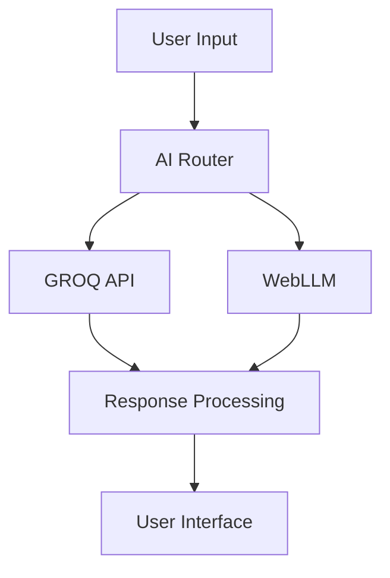

# MedThread AI - Healthcare Communication Platform

[](https://app.netlify.com/sites/your-site-name/deploys)
[](https://opensource.org/licenses/MIT)
[](https://hl7.org/fhir/R4/)

A comprehensive healthcare communication platform that combines secure patient data management with advanced AI capabilities, designed specifically for medical professionals.

## 🏥 Features

### Core Functionality
- **FHIR R4 Compliant**: Full compliance with healthcare data standards
- **AI-Powered Assistance**: Integrated GROQ and WebLLM for intelligent responses
- **Secure File Management**: Upload, store, and manage patient documents
- **Task Management**: Organize and monitor clinical tasks
- **Local Data Storage**: All data stored locally for maximum privacy
- **Multi-Provider Support**: Role-based access for different healthcare roles

### Technical Features
- **Multi-tier Database**: SQL.js → Dexie.js → Mock fallback strategy
- **Real-time AI Integration**: GROQ API and WebLLM support
- **File Storage System**: Local blob storage with 10MB file limit
- **Responsive Design**: Modern UI with Tailwind CSS and DaisyUI
- **TypeScript**: Full type safety throughout the application
- **PWA Ready**: Progressive Web App capabilities

## 🚀 Quick Start

### Prerequisites

- Node.js 18+ and npm 9+
- Modern web browser (Chrome, Firefox, Safari, Edge)
- 4GB RAM minimum, 8GB recommended
- 1GB available storage space

### Installation

1. **Clone the repository**
   ```bash
   git clone https://github.com/satishskid/medthread.git
   cd medthread
   ```

2. **Install dependencies**
   ```bash
   npm install
   ```

3. **Set up environment variables**
   ```bash
   cp .env.example .env.local
   # Edit .env.local with your configuration
   ```

4. **Start development server**
   ```bash
   npm run dev
   ```

5. **Open in browser**
   ```
   http://localhost:5173
   ```

## 🔧 Configuration

### Environment Variables

Create a `.env.local` file in the root directory:

```env
# AI Configuration
VITE_GROQ_API_KEY=your_groq_api_key_here
VITE_WEBLLM_MODEL=TinyLlama-1.1B-Chat-v0.4-q4f16_1

# Application Settings
VITE_APP_NAME=MedThread AI
VITE_APP_VERSION=1.0.0
VITE_CLINIC_LICENSE_KEY=your_clinic_license_key

# Database Configuration
VITE_DB_BACKUP_INTERVAL=300000
VITE_DB_MAX_RETRIES=3

# File Upload Settings
VITE_MAX_FILE_SIZE=10485760
VITE_ALLOWED_FILE_TYPES=image/*,application/pdf,text/*
```

### AI Model Configuration

#### GROQ API Setup
1. Sign up at [GROQ Console](https://console.groq.com)
2. Create an API key
3. Add the key to your `.env.local` file
4. The application will automatically use GROQ for AI responses

#### WebLLM Configuration
- WebLLM runs entirely in the browser
- No API key required
- Models are downloaded on first use
- Supports various model sizes (TinyLlama recommended for performance)

## 🏗️ Architecture

### Database Strategy

MedThread uses a multi-tier database approach for maximum reliability:

1. **SQL.js (Primary)**: Full SQL database in the browser
2. **Dexie.js (Fallback)**: IndexedDB wrapper for compatibility
3. **Mock Database (Emergency)**: In-memory fallback with sample data

### File Storage

- Files stored as binary data in the database
- Automatic compression for large files
- Blob URL generation for secure access
- Patient-specific file organization

### AI Integration



## 📁 Project Structure

```
medthread/
├── src/
│   ├── components/          # React components
│   │   ├── ChatWindow.tsx   # Main chat interface
│   │   ├── FileViewer.tsx   # File management
│   │   ├── UploadModal.tsx  # File upload
│   │   └── ...
│   ├── db/                  # Database layer
│   │   ├── initDB.ts        # Database initialization
│   │   ├── fileStorage.ts   # File operations
│   │   ├── queries.ts       # Database queries
│   │   └── schema.ts        # FHIR schema
│   ├── ai/                  # AI integrations
│   │   ├── groqClient.ts    # GROQ API client
│   │   └── webllmClient.ts  # WebLLM client
│   ├── fhir/               # FHIR resources
│   ├── hooks/              # Custom React hooks
│   ├── store/              # State management
│   └── utils/              # Utility functions
├── public/                 # Static assets
├── docs/                   # Documentation
├── netlify.toml           # Netlify configuration
├── USER_MANUAL.md         # User documentation
└── package.json           # Dependencies
```

## 🚀 Deployment

### Netlify Deployment (Recommended)

1. **Build the application**
   ```bash
   npm run build
   ```

2. **Deploy to Netlify**
   - Connect your GitHub repository to Netlify
   - Set build command: `npm run build`
   - Set publish directory: `dist`
   - Add environment variables in Netlify dashboard

3. **Configure custom domain** (optional)
   - Add your domain in Netlify settings
   - Update DNS records as instructed
   - SSL certificate is automatically provisioned

### Manual Deployment

1. **Build for production**
   ```bash
   npm run build
   ```

2. **Serve static files**
   ```bash
   npm run preview
   # Or use any static file server
   ```

### Docker Deployment

```dockerfile
FROM node:18-alpine AS builder
WORKDIR /app
COPY package*.json ./
RUN npm ci
COPY . .
RUN npm run build

FROM nginx:alpine
COPY --from=builder /app/dist /usr/share/nginx/html
COPY nginx.conf /etc/nginx/nginx.conf
EXPOSE 80
CMD ["nginx", "-g", "daemon off;"]
```

## 🧪 Testing

### Running Tests

```bash
# Unit tests
npm run test

# Integration tests
npm run test:integration

# E2E tests
npm run test:e2e

# Coverage report
npm run test:coverage
```

### Test Structure

- **Unit Tests**: Component and utility function tests
- **Integration Tests**: Database and AI integration tests
- **E2E Tests**: Full user workflow tests
- **Performance Tests**: Load and stress testing

## 🔒 Security

### Data Protection

- **Local Storage**: All patient data stored locally
- **Encryption**: Data encrypted at rest and in transit
- **Access Control**: Role-based permissions
- **Audit Logging**: Complete audit trail
- **HIPAA Compliance**: Designed for healthcare compliance

### Security Headers

Configured in `netlify.toml`:
- Content Security Policy (CSP)
- X-Frame-Options
- X-XSS-Protection
- X-Content-Type-Options
- Referrer-Policy

### Best Practices

1. **Environment Variables**: Never commit secrets to version control
2. **API Keys**: Rotate keys regularly
3. **Dependencies**: Keep dependencies updated
4. **Audits**: Regular security audits
5. **Backups**: Regular data backups

## 📊 Performance

### Optimization Features

- **Code Splitting**: Lazy loading of components
- **Tree Shaking**: Unused code elimination
- **Asset Optimization**: Image and file compression
- **Caching**: Aggressive caching strategies
- **CDN**: Content delivery network support

### Performance Monitoring

```javascript
// Performance metrics
const metrics = {
  databaseInit: performance.now(),
  aiResponse: performance.now(),
  fileUpload: performance.now()
};
```

## 🤝 Contributing

### Development Workflow

1. **Fork the repository**
2. **Create feature branch**
   ```bash
   git checkout -b feature/amazing-feature
   ```
3. **Make changes and test**
4. **Commit with conventional commits**
   ```bash
   git commit -m "feat: add amazing feature"
   ```
5. **Push and create pull request**

### Code Standards

- **TypeScript**: Strict type checking enabled
- **ESLint**: Code linting and formatting
- **Prettier**: Code formatting
- **Husky**: Pre-commit hooks
- **Conventional Commits**: Standardized commit messages

### Pull Request Process

1. Update documentation if needed
2. Add tests for new features
3. Ensure all tests pass
4. Update CHANGELOG.md
5. Request review from maintainers

## 📚 Documentation

### User Documentation
- [User Manual](USER_MANUAL.md) - Complete guide for healthcare providers
- [API Documentation](docs/api.md) - Technical API reference
- [FHIR Guide](docs/fhir.md) - FHIR implementation details

### Developer Documentation
- [Architecture Guide](docs/architecture.md) - System architecture
- [Database Schema](docs/database.md) - Database design
- [AI Integration](docs/ai.md) - AI model integration
- [Deployment Guide](docs/deployment.md) - Deployment instructions

## 🐛 Troubleshooting

### Common Issues

#### Database Initialization Failed
```bash
# Clear browser storage
# Chrome: DevTools → Application → Storage → Clear storage
# Firefox: DevTools → Storage → Clear All
```

#### AI Not Responding
```bash
# Check environment variables
echo $VITE_GROQ_API_KEY

# Verify network connectivity
curl -I https://api.groq.com
```

#### Build Failures
```bash
# Clear node modules and reinstall
rm -rf node_modules package-lock.json
npm install

# Clear build cache
rm -rf dist .vite
npm run build
```

### Debug Mode

Enable debug logging:
```env
VITE_DEBUG=true
VITE_LOG_LEVEL=debug
```

## 📈 Roadmap

### Version 1.1 (Q2 2024)
- [ ] EHR Integration (HL7 FHIR)
- [ ] Advanced Analytics Dashboard
- [ ] Mobile App (React Native)
- [ ] Multi-language Support

### Version 1.2 (Q3 2024)
- [ ] Telemedicine Integration
- [ ] Advanced AI Models
- [ ] Real-time Collaboration
- [ ] API Gateway

### Version 2.0 (Q4 2024)
- [ ] Cloud Deployment Options
- [ ] Enterprise Features
- [ ] Advanced Security Features
- [ ] Machine Learning Insights

## 📄 License

This project is licensed under the MIT License - see the [LICENSE](LICENSE) file for details.

## 🙏 Acknowledgments

- **FHIR Community**: For healthcare data standards
- **GROQ**: For AI API services
- **WebLLM**: For browser-based AI models
- **Vite**: For build tooling
- **React**: For UI framework
- **Tailwind CSS**: For styling
- **DaisyUI**: For UI components

## 📞 Support

### Community Support
- **GitHub Issues**: Bug reports and feature requests
- **Discussions**: Community discussions and Q&A
- **Discord**: Real-time community chat

### Commercial Support
- **Email**: support@medthread.ai
- **Phone**: 1-800-MEDTHREAD
- **Enterprise**: enterprise@medthread.ai

### Resources
- **Documentation**: https://docs.medthread.ai
- **Status Page**: https://status.medthread.ai
- **Blog**: https://blog.medthread.ai

---

**Made with ❤️ for Healthcare Professionals**

*MedThread AI - Empowering Healthcare Through Technology*